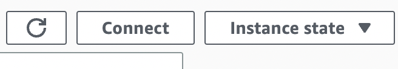

# DEPLOY TO [AWS](https://aws.amazon.com/)

## Создание сервера

Нажмите на кнопку "Вход в консоль"

Выберите Root user и введите свои данные

В поиске введите "ЕС2" и выберите самый первый сервис

Слева найдите раздел "Instances" и перейдите туда.

Далее нажмите на кнопку "Launch instances"

В разделе "Name and tags" выберите имя для своего инстанса(компьютера)

В разделе "Application and OS Images (Amazon Machine Image)" выберите образ Ubuntu для инстанса. И обратите внимание, чтобы возле версии Ubuntu была надпись "Free tier eligible"

В разделе "Instance type" выберите t2.micro, либо другой, где написано "Free tier eligible"

В разделе "Key pair login" нажмите "Create new key pair", дайте имя ключу (любое) и нажмите "Create key pair" после чего на ваш компьютер загрузится файл с именем ключа. 

В разделе "Network settings" везде расставьте галочки.

И все! Можете создать инстанс, нажав на кнопку "Launch instance"

## Подлкючение к серверу

После создания сервера, вас перебросит на страницу "Next Steps".

Найдите и нажмите на кнопку "View All Instances"

Выделите галкой свой сервер

Сверху загорится кнопка "Connect", нажмите на нее

После чего нажмите на кнопку "Connect" ниже
