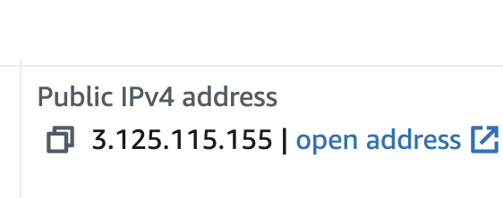

# DEPLOY TO [AWS](https://aws.amazon.com/)


## Создание сервера


Нажмите на кнопку "Вход в консоль"

Выберите Root user и введите свои данные

В поиске введите "ЕС2" и выберите самый первый сервис


Слева найдите раздел "Instances" и перейдите туда.

Далее нажмите на кнопку "Launch instances"


В разделе "Name and tags" выберите имя для своего инстанса(компьютера)

В разделе "Application and OS Images (Amazon Machine Image)" выберите образ Ubuntu для инстанса. И обратите внимание, чтобы возле версии Ubuntu была надпись "Free tier eligible"


В разделе "Instance type" выберите t2.micro, либо другой, где написано "Free tier eligible"

В разделе "Key pair login" нажмите "Create new key pair", дайте имя ключу (любое) и нажмите "Create key pair" после чего на ваш компьютер загрузится файл с именем ключа. 

В разделе "Network settings" везде расставьте галочки.


И все! Можете создать инстанс, нажав на кнопку "Launch instance"


## Подлкючение к серверу

После создания сервера, вас перебросит на страницу "Next Steps".

Найдите и нажмите на кнопку "View All Instances"


Выделите галкой свой сервер


Сверху загорится кнопка "Connect", нажмите на нее


После чего нажмите на кнопку "Connect" ниже


## Настройка сервера

Обновите пакеты

```bash
sudo apt update
```

Установите postgres, nginx

```bash
sudo apt install postgresql postgresql-contrib nginx
```

### Настройка базы данных

Выполните вход в интерактивный сеанс Postgres, введя следующую команду:

```bash
sudo -u postgres psql
```

Вначале создайте базу данных для своего проекта:

```bash
postgres=# CREATE DATABASE ubuntu;
```

Затем создайте пользователя базы данных для проекта.

```bash
postgres=# CREATE USER ubuntu WITH PASSWORD '1' SUPERUSER;
```

```bash
postgres=# GRANT ALL PRIVILEGES ON DATABASE ubuntu TO ubuntu;
```

Выйдите из postgres

```bash
postgres=# \q
```

### Настройка django проекта

```bash
sudo apt install python3.10-venv
```

```bash
git clone <link_to_your_project>
```

```bash
cd `project_folder`

python3 -m venv venv

pip install -r requirements.txt gunicorn

python3 manage.py collectstatic
```

### Настройка gunicorn

Создайте и откройте файл сокета systemd для Gunicorn с привилегиями sudo:

```bash
sudo nano /etc/systemd/system/gunicorn.socket
```

Вставьте в открывшийся файл следующий текст

```bash
# /etc/systemd/system/gunicorn.socket
[Unit]
Description=gunicorn socket

[Socket]
ListenStream=/run/gunicorn.sock

[Install]
WantedBy=sockets.target
```

Теперь создайте и откройте служебный файл systemd для Gunicorn в текстовом редакторе с привилегиями sudo. Имя файла службы должно соответствовать имени файла сокета за исключением расширения:

```bash
# /etc/systemd/system/gunicorn.service
[Unit]
Description=gunicorn daemon
Requires=gunicorn.socket
After=network.target

[Service]
User=sammy
Group=www-data
WorkingDirectory=/home/ubuntu/`project_folder`
ExecStart=/home/sammy/`project_folder`/venv/bin/gunicorn \
          --access-logfile - \
          --workers 3 \
          --bind unix:/run/gunicorn.sock \
          `myproject`.wsgi:application

[Install]
WantedBy=multi-user.target
```

`project_folder` - папка с проектом
`myproject` - папка, в которой лежит файл settings.py


Теперь мы можем запустить и активировать сокет Gunicorn.

```bash
sudo systemctl start gunicorn.socket
sudo systemctl enable gunicorn.socket
```


### Настройка Nginx для Gunicorn

Для начала нужно создать и открыть новый серверный блок в каталоге Nginx sites-available:

```bash
sudo nano /etc/nginx/sites-available/`myproject`
```

```bash
# /etc/nginx/sites-available/`myproject`

server {
    listen 80;
    server_name `ip-address`;

    location = /favicon.ico { access_log off; log_not_found off; }

    location /static/ {
        root /home/ubuntu/`project_folder`;
    }

    location /media/ {
        root /home/ubuntu/`project_folder`;
    }

    location / {
        include proxy_params;
        proxy_pass http://unix:/run/gunicorn.sock;
    }
}
```

``ip-address`` вашего сервера вы можете найти в разделе Instances, выделив машинку галочкой и заглянув в раздел как на картинке


Теперь мы можем активировать файл, привязав его к каталогу sites-enabled:

```bash
sudo ln -s /etc/nginx/sites-available/`myproject` /etc/nginx/sites-enabled
```

Протестируйте конфигурацию Nginx на ошибки синтаксиса:

```bash
sudo nginx -t
```

Если ошибок не будет найдено, перезапустите Nginx с помощью следующей команды:

```bash
sudo systemctl restart nginx
sudo ufw delete allow 8000
sudo ufw allow 'Nginx Full'
```

Чтобы работали static файлы, перейдите в корневую папку и введите там следующие команды

```bash
cd
chmod 755 .
```

Если Вы сделали правильно, то теперь можно перейти по `ip-address` и попасть на свое django приложение


